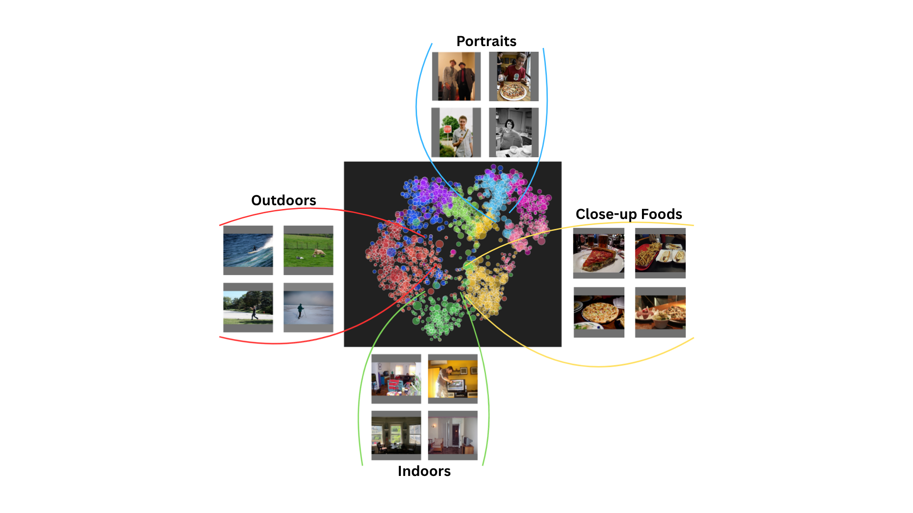
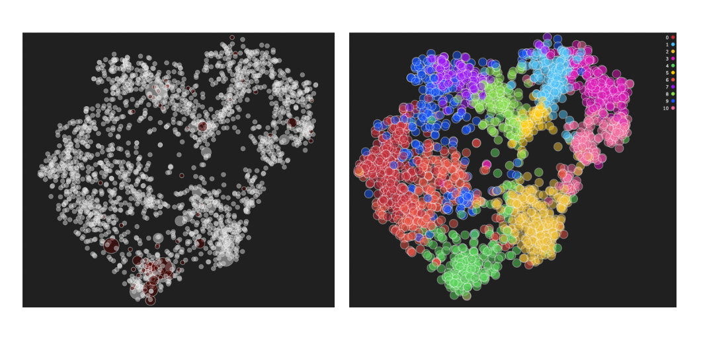
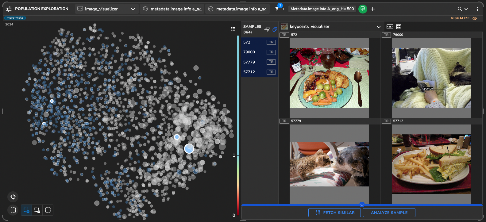
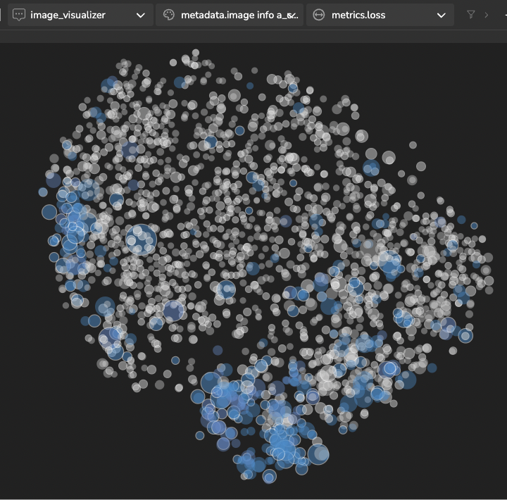
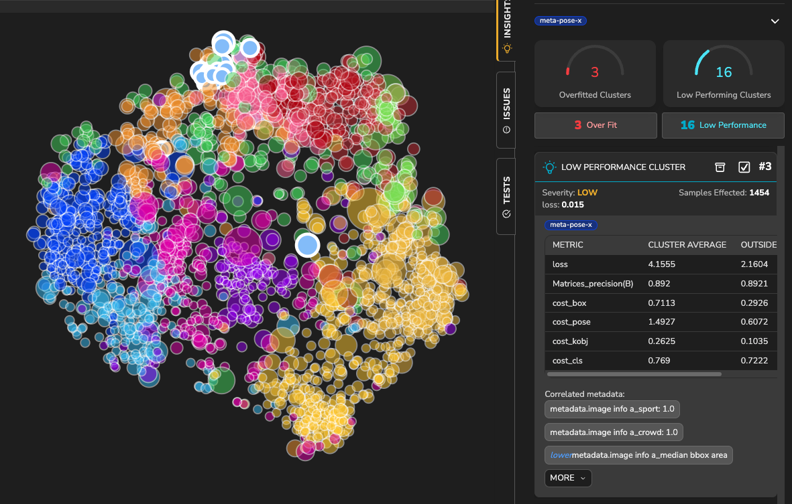
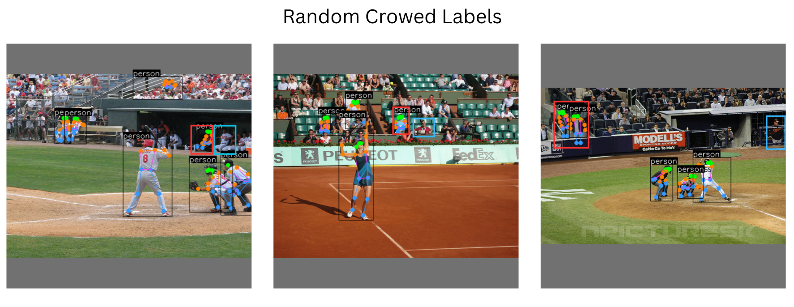
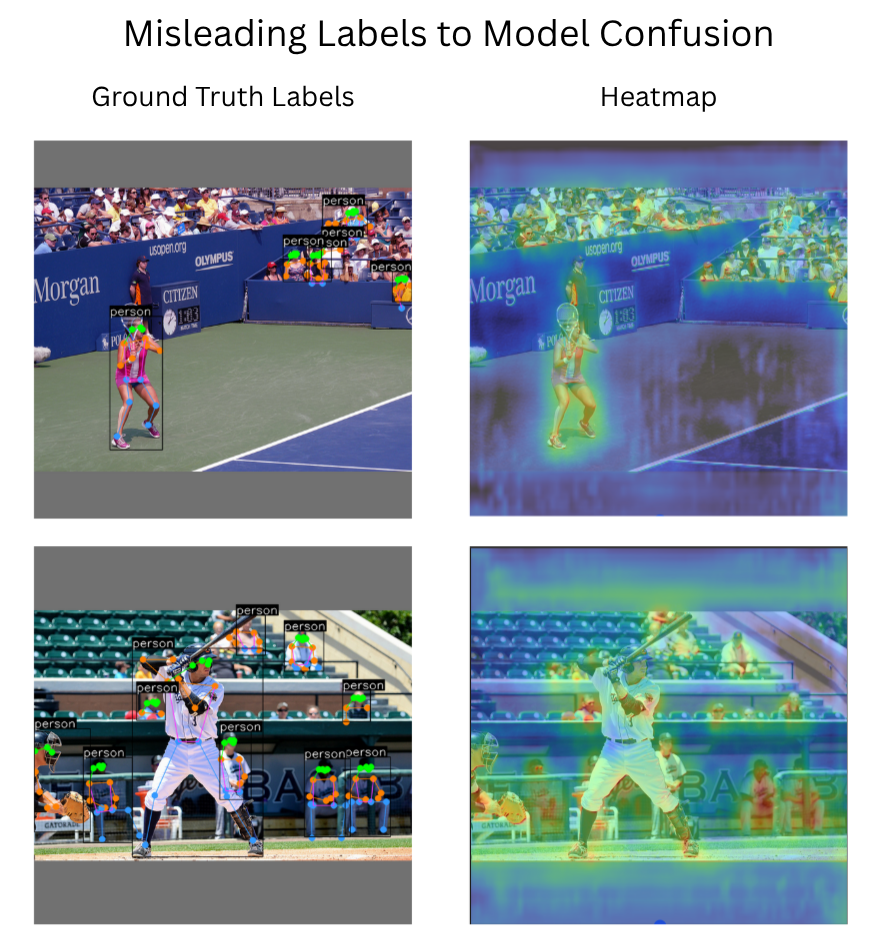
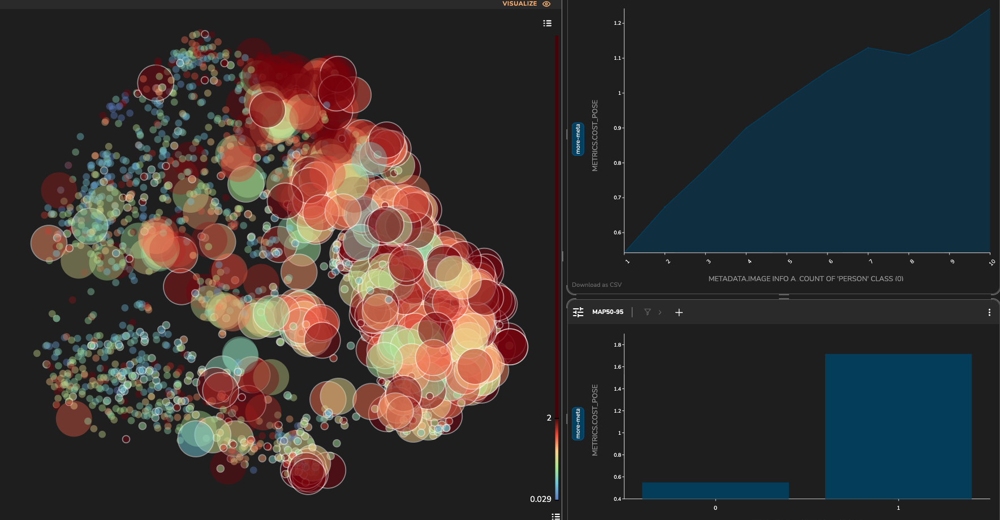
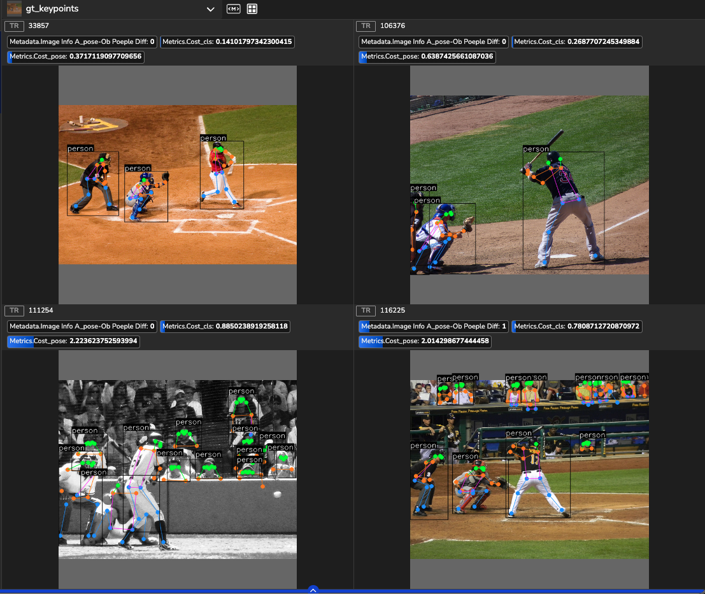

# Pose Estimation Analysis with Tensorleap  

This project demonstrates how **Tensorleap** can be used to interpret and diagnose pose-estimation models by linking internal representations, data characteristics, and performance behavior.  
Through this exploration, we uncover key failure modes—from close-up occlusions to mislabeled crowded scenes—and show how such insights can guide data curation and model refinement.  

---

## 🧩 Introduction  

Developing deep learning models often depends on intuition and empirical tuning.  
At **Tensorleap**, we transform this process into a **data-driven workflow** by exposing a model’s internal activations and decision pathways.  

Our platform links:
- Input data  
- Learned representations  
- Performance metrics  

This helps developers identify what the model actually learns, where it fails, and how to improve it.  

In this project, we apply Tensorleap to a challenging vision task: **pose estimation**—detecting and localizing human keypoints that together form a skeletal representation of body posture.

---

## 📊 Dataset and Model  

We use the **COCO (Common Objects in Context)** dataset, a standard benchmark for pose estimation.  
COCO provides:
- Human keypoint annotations  
- Object detection and segmentation labels  
- Scene-level diversity for contextual learning  

Our analysis builds on the **Ultralytics YOLOv11 Pose** model, focusing on its internal representations and performance patterns using Tensorleap’s interpretability tools.

---

## 🌌 Latent Space Exploration  

Tensorleap captures activations across the model’s computational graph and extracts a **latent representation** for each example.  
These representations form a **contextual latent space**—a high-dimensional map of how the model internally organizes and interprets the data.

By exploring this latent space, we can uncover:
- Concepts the model has learned  
- How these relate to performance and metadata  

**Figure 1:** Examples of learned concepts as clustered using Tensorleap’s platform.  

**Figure 2:** t-SNE projection of the latent space with 11 clusters. Meta-data highlights show how indoor scenes with TVs and keyboards group together in cluster 4.  

---

## 🔍 Understanding Model Insights with Tensorleap  

Beyond visualizing the latent space, Tensorleap enables an **evidence-driven exploration** of model behavior.  
By linking each cluster to performance metrics and metadata, we can identify where the model struggles, what patterns it has learned, and how these relate to specific input characteristics.  
The following insights demonstrate how this approach translates complex internal activations into clear, actionable understanding of model strengths and weaknesses.

---

## 🐾 Insight 1 — Low Performance in Close-ups  

The **low-performance cluster** highlights samples where **classification loss** (detecting if a person is present) is about **2× higher** than average.  
Meta-data links this cluster to **low pose visibility** (occlusions) and **few people per image**, suggesting difficulty identifying humans in close or cluttered scenes.

Two main trends emerge:
- Close-up shots of **food** on tables  
- Close-up shots of **pets** (e.g., cats)  

Coloring samples by meta-data (e.g., “dining table” presence) and scaling by “cat” presence reveals distinct **food** and **pet** subgroups.  

**Figure 3:** Low-performance cluster showing close-up images of food and pets.  

From a task perspective, these are close-up or non-human images where the model **over-predicts human presence**.  
Despite the dataset being biased toward images without people, the model often predicts people where none exist—possibly a learned bias to minimize false negatives.  

**Figure 4:** Class imbalance of people vs. no-people and the corresponding effect on loss magnitude.  

---

## 🏟️ Insight 2 — Label Inconsistencies in Stadium Scenes  

### Label Inconsistencies
**Figure 5:** Insight detection panel - Right - Identification alert in the platform highlights the affected matrices and number of scenes, on the bottom correlated meta-data is shown. Left - Population latent space, highlighted in white circle are the member examples of the insight.  

Another cluster shows degradation across all losses—**box, pose, keypoint-objectness, and class**—and correlates with **sports and stadium scenes** containing many people.  
Inspection of COCO annotations reveals **inconsistent labeling**: spectators are often unlabeled or partially annotated.  

By comparing **object-detection (OB)** and **pose** ground truth, we find a **median gap of 13 people per image**, exposing inconsistencies in what annotators labeled (players vs. full crowds).  

**Figure 6:** Examples of partial crowd labeling. Red rectangles mark labeled spectators; blue mark unlabeled ones.  

This leads to contradictory training signals: the model is penalized for missing unlabeled spectators yet also for predicting them.  
Activation heatmaps confirm that the model attends to both players and crowds, showing confusion about what constitutes a “valid” person-with-pose.”  

**Figure 7:** Heatmaps showing model focus on labeled and unlabeled humans in crowd scenes.  

### Quantifying the Impact of Crowding  

While higher pose loss might seem due to complex sports motion, analysis shows it stems mainly from **unlabeled background people**.  
Crowded scenes (>4 people) show **3× higher pose loss** than isolated scenes.  

**Figure 8:** Pose loss vs. crowd density in baseball scenes.  

Nearly identical player poses yield losses of **0.3 vs. 2.0**, depending on the crowd labeling.  
**Figure 9:** Comparison of baseball scenes with and without crowds.  

These results indicate that **label noise, not pose difficulty**, drives much of the observed degradation.

---

## 🧠 Summary  

This analysis highlights how Tensorleap helps uncover what drives model behavior beyond standard metrics.  
By exploring latent representations and clustering performance, we revealed two key challenges in pose estimation:
1. Close-up occlusions causing false positives  
2. Inconsistent labeling in crowded sports scenes  

These findings are just a glimpse of what can be achieved with the Tensorleap platform.  
Further analysis—through **data curation**, **retraining**, and **extended cluster exploration**—can validate these hypotheses and convert interpretability into measurable performance gains.

---
## Next Steps
* Curious how you can benefit from Tensorleap? [Reach out for a demo](https://tensorleap.ai/request-demo/).
* Want to explore this Tensorleap use-case yourself? [Step-by-Step Guide](ultralytics/tensorleap_folder/README.md).
